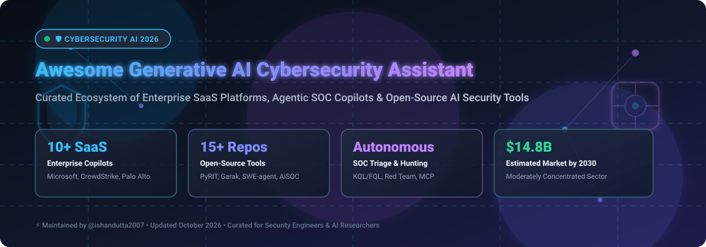

<p align="center">
  
</p>

<h1 align="center">🛡️ Awesome Generative AI Cybersecurity Assistant 🤖</h1>

<p align="center">
  <b>A Curated List of Enterprise SaaS Platforms, Agentic Security Copilots, Autonomous SOC Assistants & Open-Source AI Security Tooling</b>
</p>

<p align="center">
  <a href="https://github.com/ishandutta2007/Awesome-Awesome-Awesome"></a><a href="https://discord.gg/jc4xtF58Ve"></a>
  <a href="https://github.com/ishandutta2007/Awesome-Generative-AI-Cybersecurity-Assistant/stargazers"></a>
  <a href="https://github.com/ishandutta2007/Awesome-Generative-AI-Cybersecurity-Assistant/network/members"></a>
  <a href="https://github.com/ishandutta2007/Awesome-Generative-AI-Cybersecurity-Assistant/blob/main/LICENSE"></a>
  <a href="https://github.com/ishandutta2007"></a>
</p>

---

## 📌 Overview & Ecosystem Landscape

This repository tracks top-tier **commercial SaaS platforms** and high-impact **open-source GitHub projects** in the **Generative AI Cybersecurity Assistant** space. 

Modern Security Operations Centers (SOCs) leverage Generative AI, Large Language Models (LLMs), and autonomous agent frameworks to:
- ⚡ **Accelerate Incident Triage:** Summarize complex alert chains, correlate multi-source telemetry, and reduce Mean Time to Respond (MTTR).
- 🔍 **Automate Threat Hunting:** Translate natural language queries into SIEM/EDR query languages (KQL, FQL, Splunk SPL).
- 🧠 **Enhance Threat Intelligence:** Automatically extract Indicators of Compromise (IOCs) and generate contextual threat reports.
- 🛡️ **Harden AI Systems:** Audit LLM agents against prompt injection, data leakage, and jailbreak vulnerabilities.

---

## 📑 Table of Contents
- [🏢 Enterprise SaaS & Commercial Platforms](#-enterprise-saas--commercial-platforms)
- [🔓 Open-Source GitHub Projects](#-open-source-github-projects)
- [🔍 Architectural Patterns for AI SOC Copilots](#-architectural-patterns-for-ai-soc-copilots)
- [🤝 How to Contribute](#-how-to-contribute)
- [💖 Support & Sponsorship](#-support--sponsorship)
- [📈 Star History](#-star-history)
- [⚠️ Disclaimer](#%EF%B8%8F-disclaimer)

---

## 🏢 Enterprise SaaS & Commercial Platforms

> 📊 **Market Size & Sector Dynamics:**  
> The global Generative AI in Cybersecurity market is estimated at **$2.5 Billion in 2024** and is projected to reach **$14.8 Billion by 2030** (CAGR of ~36.2%). The market is **moderately concentrated** among tier-1 cloud and enterprise endpoint security giants (Microsoft, CrowdStrike, Palo Alto Networks, Google, Cisco) due to deep telemetry lock-in. However, it remains **fragmented at the agentic & copilot niche layer**, leaving room for innovative AI-native startups and specialized security models.

*The table below is sorted descending by company size (Valuation / Market Cap).*

| SaaS Product 🚀 | Company Size 🏢 (Valuation / Revenue) | Starting Price 💵 | Free Tier / Free Trial Limits 🎁 | Key AI & Security Capabilities 🛠️ |
| :--- | :--- | :--- | :--- | :--- |
| **[Microsoft Security Copilot](https://www.microsoft.com/en-us/security/business/ai-machine-learning/microsoft-security-copilot)** | ~$3.2 Trillion (Market Cap) / ~$245B Rev | $4.00 / Security Compute Unit (SCU) / hr (~$2,880/mo baseline) | **30-day free trial** with 300 SCU credits for eligible Defender & Sentinel enterprise tenants | Natural-language SOC alert triage, automated KQL query generation, identity risk summarization, and guided remediation scripts. |
| **[Google Cloud Security AI Workbench](https://cloud.google.com/security)** | ~$2.1 Trillion (Market Cap) / ~$307B Rev | $45.00 / user / month + $0.005 / query (SecOps AI) | **90-day free trial** with $300 in Google Cloud credits usable across Chronicle & Security Command Center | SecOps natural-language search summarization, Sec-PaLM 2 malware analysis, and automated threat graph hunting. |
| **[Cisco AI Assistant for Security](https://www.cisco.com/site/us/en/products/security/index.html)** | ~$200 Billion (Market Cap) / ~$54B Rev | $15.00 / user / month (add-on for Cisco Security Cloud) | **30-day free trial** of Cisco Secure Access with full AI Assistant capabilities enabled | Automated firewall policy rule translation, encrypted traffic analysis, and rapid incident summarization. |
| **[Palo Alto Cortex Copilot](https://www.paloaltonetworks.com/cortex)** | ~$110 Billion (Market Cap) / ~$8.0B Rev | $100.00 / user / month (minimum $12,000/year platform tier) | **30-day interactive sandbox trial** with 50 test incident triage executions | Cortex XSIAM incident correlation, plain-English playbook generation, and autonomous threat hunting queries. |
| **[CrowdStrike Charlotte AI](https://www.crowdstrike.com/platform/charlotte-ai/)** | ~$70 Billion (Market Cap) / ~$3.9B Rev | $20.00 / endpoint / year (add-on to Falcon platform) | **15-day free trial** of CrowdStrike Falcon with Charlotte AI preview (up to 100 endpoints) | Agentic detection triage, Falcon Query Language (FQL) synthesis, threat actor attribution, and decision auditing. |
| **[Fortinet FortiAI](https://www.fortinet.com/)** | ~$60 Billion (Market Cap) / ~$5.3B Rev | $3,500.00 / year per FortiManager or FortiAnalyzer instance | **60-day evaluation license** with 500 query credits per month for registered partners | Security Fabric threat analysis, network configuration script generation, and SOC alert summarization. |
| **[SentinelOne Purple AI](https://www.sentinelone.com/)** | ~$7.5 Billion (Market Cap) / ~$700M Rev | $4.00 / endpoint / month ($48/endpoint/year add-on) | **30-day free trial** for Singularity Complete/Enterprise subscribers (up to 50 endpoints) | Plain-English threat hunting across Singularity Data Lake, auto-investigation notebooks, and autonomous verification. |
| **[Darktrace HEAL](https://darktrace.com/)** | ~$5.3 Billion (Valuation) / ~$680M Rev | $30,000.00 / year starting base tier (up to 250 covered assets) | **30-day Proof of Value (POV)** deployment in live environment with full SOC report | Autonomous threat mitigation, incident simulation playbooks, self-healing recovery, and Cyber AI Analyst summary. |
| **[Trellix GenAI](https://www.trellix.com/)** | ~$5.0 Billion (Valuation) / ~$1.8B Rev | $10,000.00 / year starting add-on license for Trellix XDR | **30-day POC trial** with up to 100 endpoint telemetry units | XDR alert summarization, threat intelligence enrichment, guided playbook remediation, and analyst workflow co-pilot. |
| **[Recorded Future AI](https://www.recordedfuture.com/)** | ~$2.65 Billion (Valuation) / ~$300M Rev | $18,000.00 / year starting enterprise intelligence subscription | **14-day platform trial** with 50 IOC export lookups and threat intel summarization | Real-time threat landscape summarization, automated IOC context generation, vulnerability risk scoring, and intelligence reports. |

---

## 🔓 Open-Source GitHub Projects

Open-source tools provide essential building blocks for **cybersecurity-tuned LLMs**, **LLM vulnerability scanners**, **AI red-teaming frameworks**, and **agentic SOC workflows**.

*The table below is sorted descending by GitHub Star Count.*

| Open-Source Project 🐙 | Stars ⭐ | Focus Category 🎯 | Description 💡 |
| :--- | :--- | :--- | :--- |
| **[mukul975/Anthropic-Cybersecurity-Skills](https://github.com/mukul975/Anthropic-Cybersecurity-Skills)** | [](https://github.com/mukul975/Anthropic-Cybersecurity-Skills/stargazers) | Agent Skills Framework | 817 structured cybersecurity skills for AI agents mapped to MITRE ATT&CK, NIST CSF 2.0, D3FEND, and MITRE ATLAS. |
| **[SWE-agent/SWE-agent](https://github.com/SWE-agent/SWE-agent)** | [](https://github.com/SWE-agent/SWE-agent/stargazers) | Autonomous Agent | Autonomous LM agent framework for software engineering, vulnerability patching, and offensive cybersecurity challenges. |
| **[0x4m4/hexstrike-ai](https://github.com/0x4m4/hexstrike-ai)** | [](https://github.com/0x4m4/hexstrike-ai/stargazers) | MCP Security Server | Advanced Model Context Protocol (MCP) server enabling AI agents to run 150+ security tools for automated pentesting and audit. |
| **[aliasrobotics/cai](https://github.com/aliasrobotics/cai)** | [](https://github.com/aliasrobotics/cai/stargazers) | AI Security Framework | Cybersecurity AI (CAI) open framework designed for securing AI agents, robotics, and edge security systems. |
| **[NVIDIA/garak](https://github.com/NVIDIA/garak)** | [](https://github.com/NVIDIA/garak/stargazers) | LLM Scanner ("Nmap for LLMs") | Open-source LLM vulnerability scanner to probe security assistants for prompt injection, hallucinations, and jailbreaks. |
| **[NVIDIA-NeMo/Guardrails](https://github.com/NVIDIA-NeMo/Guardrails)** | [](https://github.com/NVIDIA-NeMo/Guardrails/stargazers) | Guardrails & Safety | Toolkit for adding programmable safety, topical, and security guardrails to conversational LLM systems. |
| **[infobyte/faraday](https://github.com/infobyte/faraday)** | [](https://github.com/infobyte/faraday/stargazers) | Vulnerability Management | AI-powered open-source collaborative vulnerability management platform for penetration testing and offensive operations. |
| **[fr0gger/Awesome-GPT-Agents](https://github.com/fr0gger/Awesome-GPT-Agents)** | [](https://github.com/fr0gger/Awesome-GPT-Agents/stargazers) | GPT Agents Collection | Curated list of specialized GPT agents and copilots for SOC alert triage, malware analysis, and threat intelligence. |
| **[BitterSecurity/Decepticon](https://github.com/BitterSecurity/Decepticon)** | [](https://github.com/BitterSecurity/Decepticon/stargazers) | Autonomous Red Team | Autonomous red-teaming hacking agent that executes dynamic reconnaissance and attack paths using LLM reasoning. |
| **[intuitem/ciso-assistant-community](https://github.com/intuitem/ciso-assistant-community)** | [](https://github.com/intuitem/ciso-assistant-community/stargazers) | AI GRC Platform | Open-source GRC platform supporting 200+ security frameworks with automatic compliance control mapping and risk evaluation. |
| **[meta-llama/PurpleLlama](https://github.com/meta-llama/PurpleLlama)** | [](https://github.com/meta-llama/PurpleLlama/stargazers) | Security Benchmarks | Meta's evaluation tools (CyberSecEval) for probing LLM cyberattack capabilities and code security. |
| **[alexandreborges/malwoverview](https://github.com/alexandreborges/malwoverview)** | [](https://github.com/alexandreborges/malwoverview/stargazers) | Threat Hunting & Triage | First response threat hunting tool combining multi-engine scanners with LLM enrichment and IOC extraction. |
| **[protectai/llm-guard](https://github.com/protectai/llm-guard)** | [](https://github.com/protectai/llm-guard/stargazers) | Input/Output Security | Security toolkit for evaluating and sanitizing prompts and model responses against injection, PII leak, and toxicity. |
| **[Azure/PyRIT](https://github.com/Azure/PyRIT)** | [](https://github.com/Azure/PyRIT/stargazers) | AI Red Teaming | Microsoft's Python Risk Identification Tool for automated, multi-turn red-teaming of generative AI applications. |
| **[beenuar/AiSOC](https://github.com/beenuar/AiSOC)** | [](https://github.com/beenuar/AiSOC/stargazers) | Self-Hosted AI SOC | Open-source AI Security Operations Center providing LLM-agent alert triage, MITRE ATT&CK investigation, and replayable decision ledgers. |
| **[beelzebub-labs/beelzebub](https://github.com/beelzebub-labs/beelzebub)** | [](https://github.com/beelzebub-labs/beelzebub/stargazers) | AI Honeypot Runtime | Secure low-code deception runtime framework using AI for system virtualization and attacker telemetry capture. |

---

## 🔍 Architectural Patterns for AI SOC Copilots

Building a self-hosted or hybrid **GenAI Cybersecurity Assistant** typically requires integrating three core components:

```
[ SIEM / EDR / Telemetry ] ──> [ Context Retrieval / RAG ] ──> [ Cyber-Tuned LLM / Agent ] ──> [ Guardrails / Playbook Execution ]
```

1. **Context Engine (RAG over SecOps Data):**  
   Connect local vector stores (e.g., Qdrant, Chroma) populated with MITRE ATT&CK techniques, internal incident runbooks, and active threat intelligence feeds.

2. **Domain Model / Fine-Tune:**  
   Utilize cyber-adapted open models (e.g., Llama-3-70B fine-tuned on security corpora) or enterprise APIs (Claude 3.5 Sonnet, GPT-4o, Gemini 1.5 Pro) equipped with function calling for KQL/SPL execution.

3. **Guardrails & Verification:**  
   Deploy tools like `NVIDIA NeMo-Guardrails` or `llm-guard` to intercept hallucinated commands or malicious prompt injections before executing SOC playbook actions.

---

## 🤝 How to Contribute

Contributions are warmly welcomed! Help keep this list up to date by following these simple steps:

1. Fork the repository 🍴
2. Create a feature branch (`git checkout -b add-new-tool`)
3. Add your entry to either the **SaaS Table** or **Open-Source Table** following the existing layout and column format.
4. Open a Pull Request with a short summary of the project and why it belongs here. 🚀

---

## 💖 Support & Sponsorship

If you find this repository helpful for your security research, SOC engineering, or AI project, please consider supporting the project:

- ⭐ **Star this repository** to help others discover it!
- 🍴 **Fork it** to customize it for your internal security team.
- 📢 **Share it** on LinkedIn, Twitter/X, or Reddit.
- ☕ **Buy me a coffee / Sponsor the project:**

<p align="center">
  <a href="https://github.com/sponsors/ishandutta2007">
    
  </a>
</p>

---

## 📈 Star History

[](https://star-history.dera.page/#ishandutta2007/Awesome-Generative-AI-Cybersecurity-Assistant&type=date&legend=top-left)

---

## ⚠️ Disclaimer

- This list is **community-curated** for educational and informational purposes only.
- Generative AI models can hallucinate, produce incorrect security advice, or recommend unverified commands. **Always maintain human-in-the-loop oversight** for all production SOC remediation actions.
- References to commercial SaaS products do not constitute an endorsement.

---

<p align="center">
  <b>Curated with ❤️ by <a href="https://github.com/ishandutta2007">Ishan Dutta</a> and the Open Security AI Community.</b>
</p>
